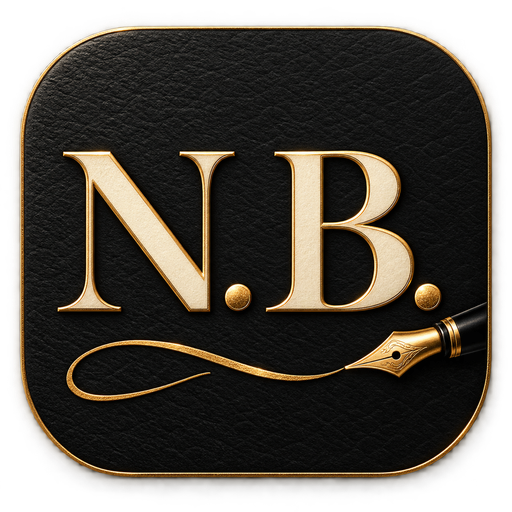
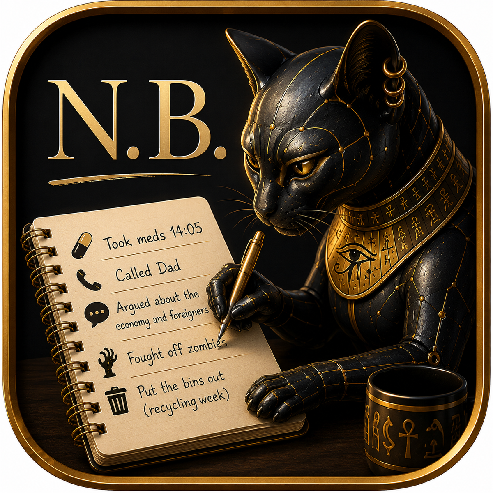

<div align="center">


<p align="center">
  
</p>

### A small personal app for recording the things worth remembering.

[](https://developer.android.com/)
[](https://kotlinlang.org/)
[](#current-milestone)
[](#data)

[**Download the current Android development build**](https://github.com/AndyJMyers/Nota-Bene/releases/download/v0.9.0-alpha26/nota-bene-dev.apk)

> **Enter it. Keep it. Show it back. Remind me when necessary. Export it when asked.**

</div>

<p align="center">
  
</p>

Nota Bene is being built first and foremost as a personal utility: fast to use, locally persistent, deliberately simple, and designed around information that is easy to forget but useful to have recorded.

## Current scope

| Instrument | Purpose |
| :--- | :--- |
| **SPEND** | Card payments by receipt, manual entry or voice |
| **MEDS** | Medicines, daily doses, stock counts and reorder warnings |
| **SOMA** | Symptoms, blood pressure and other health observations |
| **TASK** | Lightweight to-dos and simple dependencies |
| **ASK** | Research questions and completion tracking |

### SPEND

Quickly record card payments using whichever method is easiest at the time:

- photograph a receipt and capture the useful information;
- enter the details manually;
- use system speech recognition.

Captured payment data is stored locally. Receipt photographs are an input mechanism rather than a permanent image archive.

### MEDS

Record medicines and other user-defined consumables with enough information to make everyday management easier. Each entry has a first reminder time, a user-stated usual daily count, remaining-dose count and reorder threshold. Every actual dose can be recorded—even after another has already been logged that day—and halted entries retain their histories when a dosage changes.

A discreet `today/usual` indicator moves from white to green, amber and red as the recorded count passes the user’s own usual count. It is a factual personal reference, not a clinical limit or dose recommendation.

The app shows due, overdue and reorder states and provides local Android notifications after a dose becomes overdue, with a further early-evening reminder if it remains unrecorded. Reminder checks survive app closure and phone restart, but Android may delay or suppress notifications: they are a helpful aid, not a guaranteed or sole medicine reminder.

### SOMA

Record simple health-related observations such as symptoms, blood-pressure measurements and similar information. How this develops will be determined by actual use rather than by attempting to design every possible feature in advance.

### TASK

A lightweight place for things that need doing, including simple dependencies where one action is waiting on another. This is intentionally not intended to become a project-management system.

### ASK

A place to record questions that need further investigation. Items can be entered by typing or speech, marked complete and hidden from the active list. Follow-on notes and deletion are not yet implemented.

## Data

Anything deliberately entered or accepted by the user is treated as the recorded truth until the user changes it.

Primary data is stored locally in a Room database and survives application closure and phone restart. The expected data volume is small.

The `*` settings control contains the export action. It opens Android's standard save picker and creates a dated XLSX workbook with five worksheets: **SPEND**, **MEDS**, **SOMA**, **TASK** and **ASK**. Completed, hidden and halted records are included, together with medicine dose history.

> Personal and medical records stay on-device and Android backup is disabled. They leave only when the user explicitly exports an XLSX workbook. Bundled receipt OCR may send Google limited technical diagnostics, never the receipt image, recognised text or Nota Bene database.

## Design

Nota Bene uses the same interface language throughout. Its tabs are large industrial radio-style controls presented on a single line:

<div align="center">

`SPEND` · `MEDS` · `SOMA` · `TASK` · `ASK`

</div>

The selected control appears illuminated from behind, like a filament bulb glowing through slightly grimy stained glass; unselected controls remain dimmed. Selecting a tab fades its title into view.

The visual character is **retro-futurist rather than steampunk**: functional machinery from an imagined future, not decorative Victorian engineering.

A mood control moves through **dark purple · blue · yellow fusion · quinacridone crimson**. It also governs the pace and intensity of four atmospheric backgrounds:

- a twinkling night sky with a distant supernova and occasional comets;
- wind-drifted falling snow;
- slow-moving oil colour;
- a layered maritime scene with travelling breakers, spray, shore wash and a tiny square-rigger.

A single control cycles forward through the effects. Nota Bene is a utility, not a visualisation application.

## Current milestone

**Alpha 26 (`v0.9.0-alpha26`)** provides:

- a native Kotlin and Jetpack Compose application;
- the consistent five-tab shell and instrument-panel visual language;
- the continuous four-colour mood control and four animated backgrounds;
- local persistence through Room;
- a five-sheet XLSX export through Android's save picker;
- tap-away keyboard dismissal throughout the app;
- expandable medicine dose histories;
- repeat same-day MEDS logging with a discreet user-referenced consumption indicator;
- the new N.B. fountain-pen identity in the launcher, app header and project page;
- reliable sensor-driven rotation with system-bar-safe content;
- continuous vertical scrolling through every instrument panel;
- persistent local MEDS reminders across app closure and phone restart; and
- private-detail MEDS notifications with a generic locked-screen message;
- disabled cloud and device-transfer backup;
- complete local erasure of records and reminder state; and
- one compact `*` settings sheet for reminders, XLSX export and a plain-English privacy and safety notice.

The SPEND circuit supports manual entry, system speech recognition and on-device receipt OCR. Every captured result remains editable before it is stored in a Room database and shown in the payment history after restart.

The ASK circuit supports typed or spoken items, persistent open/done state, checkbox completion and hiding completed items.

The TASK circuit provides the same persistent spoken-or-typed checklist, with an optional lightweight “waiting on” dependency for each task.

The SOMA circuit records typed or spoken symptoms and observations, optional measurements and automatic timestamps in a persistent history.

The MEDS circuit records every dose at an explicit taken time, compares the day’s count discreetly with a user-stated usual count, retains the full expandable history, counts remaining stock, signals reorder time and preserves halted histories when dosage changes. It does not prevent or prescribe what the user records.

The current development APK is published as a GitHub pre-release:

- [Download `nota-bene-dev.apk` (Alpha 26)](https://github.com/AndyJMyers/Nota-Bene/releases/download/v0.9.0-alpha26/nota-bene-dev.apk)
- SHA-256: `08DB2A601BC31BD1E0FA31D17887F83A7B36C04187CDFE72E31FDD7EB9C51FA6`

Near-term work is practical rather than expansive: test receipt extraction, notification privacy, reminder timing and complete erasure on real devices; verify exports in common spreadsheet applications; and complete release-candidate publication details. The maintained UI baseline and product-test priorities are in the [TODO](TODO.md).

## Build

Open the repository in Android Studio, or run on Windows:

```powershell
.\gradlew.bat assembleDebug
```

The project targets Android 16 (API 36) and supports Android 8+ (API 26).

## Google Play preparation

First-draft publication documents are kept in [`docs/google-play`](docs/google-play):

- [store listing copy and asset brief](docs/google-play/STORE_LISTING.md);
- [privacy policy](docs/google-play/PRIVACY_POLICY.md);
- [Data Safety answers](docs/google-play/DATA_SAFETY_DRAFT.md);
- [Health Apps declaration](docs/google-play/HEALTH_DECLARATION_DRAFT.md); and
- [submission checklist](docs/google-play/SUBMISSION_CHECKLIST.md).

The current data flows, UK GDPR position, reminder limitations and medical-purpose boundary are recorded in the [compliance position](docs/google-play/COMPLIANCE_POSITION.md).

These remain working drafts until the release candidate, public privacy contact and hosted privacy-policy URL are final.

## Development approach

Nota Bene is initially being developed for its creator's own regular use. Features will be added or removed according to whether they prove useful in practice. Only if it becomes a genuinely useful daily companion will a wider release be considered.

The priority is not feature count. It is making a small application pleasant enough, fast enough and useful enough to keep opening.

The working method developed through 32 Visualisations and Nota Bene is recorded in [The Human–AI Android Manifesto](docs/HUMAN_AI_ANDROID_MANIFESTO.md).

## Repository policy

This repository is publicly visible so builds can be downloaded and verified. Nota Bene remains a privately directed personal project: external pull requests are not accepted, and publication here is not an invitation to contribute code.
