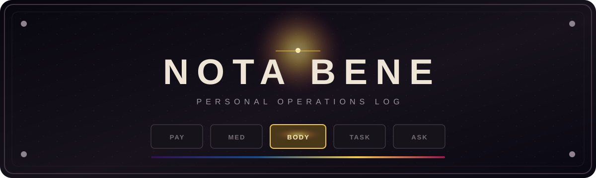

<div align="center">



### A small personal app for recording the things worth remembering.

[](https://developer.android.com/)
[](https://kotlinlang.org/)
[](#development-approach)
[](#data)

> **Enter it. Keep it. Show it back. Remind me when necessary. Export it when asked.**

</div>

Nota Bene is being built first and foremost as a personal utility: fast to use, locally persistent, deliberately simple, and designed around information that is easy to forget but useful to have recorded.

## Current scope

| Instrument | Purpose |
| :--- | :--- |
| **PAY** | Card payments by receipt, manual entry, voice or conversation |
| **MED** | Medicines, prescriptions, reorder warnings and reminders |
| **BODY** | Symptoms, blood pressure and other health observations |
| **TASK** | Lightweight to-dos and simple dependencies |
| **ASK** | Questions, investigations and follow-on research notes |

### Payments

Quickly record card payments using whichever method is easiest at the time:

- photograph a receipt and capture the useful information;
- enter the details manually;
- use conversational or voice input where appropriate.

Captured payment data is stored locally. Receipt photographs are an input mechanism rather than a permanent image archive.

### Medicine

Record medicines and prescriptions with enough information to make everyday management easier. The app should provide a simple visual indication when something is approaching reorder time and remind the user later in the day if action is required but has not been taken.

### Health log

Record simple health-related observations such as symptoms, blood-pressure measurements and similar information. How this develops will be determined by actual use rather than by attempting to design every possible feature in advance.

### To do

A lightweight place for things that need doing, including simple dependencies where one action is waiting on another. This is intentionally not intended to become a project-management system.

### Research

A place to record things that need further investigation. Each item consists of an initial text entry with the ability to add follow-on notes and archive or delete the item when it is no longer required.

## Data

Anything deliberately entered or accepted by the user is treated as the recorded truth until the user changes it.

Primary data is stored locally and must survive application closure and phone restart. The expected data volume is small. Data should be easily exportable, with spreadsheet/XLSX format currently preferred.

> Personal and medical data stays on-device by default. Export, backup and any future network feature will require deliberate user action.

## Design

Nota Bene uses the same interface language throughout. Its tabs are large industrial radio-style controls presented on a single line:

<div align="center">

`PAY` · `MED` · `BODY` · `TASK` · `ASK`

</div>

The selected control appears illuminated from behind, like a filament bulb glowing through slightly grimy stained glass; unselected controls remain dimmed. Selecting a tab fades its title into view.

The visual character is **retro-futurist rather than steampunk**: functional machinery from an imagined future, not decorative Victorian engineering.

A mood control moves through **dark purple · blue · yellow fusion · quinacridone crimson**. Restrained background effects begin with a slowly twinkling night sky and gentle falling snow. Nota Bene is a utility, not a visualisation application.

## Current milestone

The first buildable baseline establishes:

- a native Kotlin and Jetpack Compose application;
- the consistent five-tab shell and instrument-panel visual language;
- the four-stage mood control;
- star and snow background modes;
- placeholders for typed, voice and photo capture.

The Payments circuit supports manual entry, system speech recognition and on-device receipt OCR. Every captured result remains editable before it is stored in a Room database and shown in the payment history after restart.

The ASK circuit supports typed or spoken items, persistent open/done state, checkbox completion and hiding completed items.

The TASK circuit provides the same persistent spoken-or-typed checklist, with an optional lightweight “waiting on” dependency for each task.

The BODY circuit records typed or spoken symptoms and observations, optional measurements and automatic timestamps in a persistent history.

The MED circuit manages one daily scheduled dose per medication record, records taken doses, retains the log below the top-level view, counts remaining stock, signals reorder time and preserves halted medication histories when dosage changes.

Next: refine payment extraction through real receipt testing, then give Medicine the same complete treatment.

## Build

Open the repository in Android Studio, or run on Windows:

```powershell
.\gradlew.bat assembleDebug
```

The project targets Android 16 (API 36) and supports Android 8+ (API 26).

## Development approach

Nota Bene is initially being developed for its creator's own regular use. Features will be added or removed according to whether they prove useful in practice. Only if it becomes a genuinely useful daily companion will a wider release be considered.

The priority is not feature count. It is making a small application pleasant enough, fast enough and useful enough to keep opening.

## Repository policy

This repository is publicly visible so builds can be downloaded and verified. Nota Bene remains a privately directed personal project: external pull requests are not accepted, and publication here is not an invitation to contribute code.
